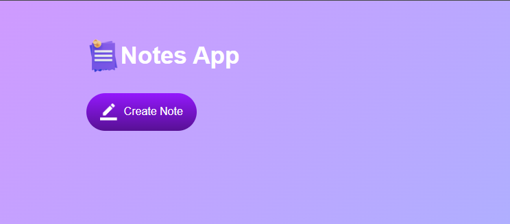
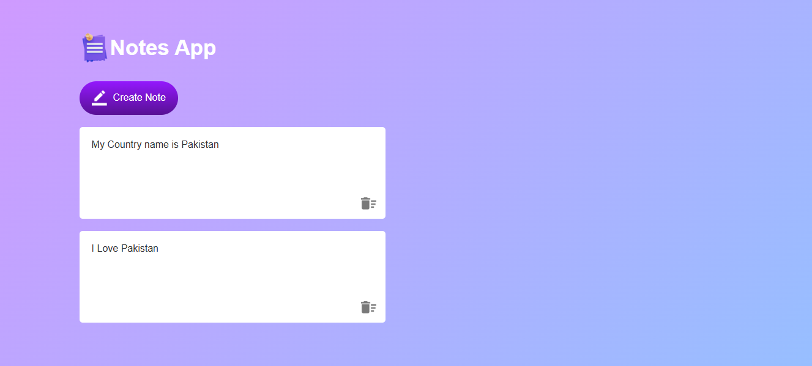

# 📝 Notes App

A simple and responsive **Notes App** built using **HTML**, **CSS**, and **JavaScript**. This application allows users to create, edit, and delete notes while automatically saving them in the browser using **Local Storage**, so notes remain available even after refreshing or reopening the page.


## 📸 Preview






## ✨ Features

- 📝 Create unlimited notes
- ✏️ Edit notes directly
- 🗑️ Delete notes with a single click
- 💾 Automatic saving using Local Storage
- 🔄 Notes persist after page refresh
- ⚡ Fast and lightweight
- 📱 Responsive and clean user interface
- 🎨 Modern gradient design

---

## 🛠️ Built With

- HTML5
- CSS3
- JavaScript (ES6)
- Local Storage API

---


---

## 🚀 Getting Started

### Clone the repository

```bash
git clone https://github.com/your-username/Notes-App.git
```

### Open the project

Navigate to the project folder and open **index.html** in your browser.

No installation or dependencies are required.

---

## 💡 How It Works

1. Click the **Create Note** button.
2. Type your note.
3. Your notes are automatically saved in the browser.
4. Refresh the page anytime—your notes will still be there.
5. Click the delete icon to remove a note.

---

## 🌟 Future Improvements

- 📌 Pin important notes
- 🌙 Dark Mode
- 🔍 Search notes
- 🏷️ Categories or Tags
- 📅 Date & Time for notes
- 🎨 Multiple themes
- 📤 Export notes as PDF or TXT
- ☁️ Cloud synchronization

---

## 🤝 Contributing

Contributions are welcome!

If you have ideas for improvements, feel free to fork the repository, make your changes, and submit a Pull Request.

---

## 📄 License

This project is licensed under the **MIT License**.

---

## 👨‍💻 Author

**Zain Ul Abidin**
GitHub: https://github.com/zain-dev-ai-ml/: 

If you like this project, don't forget to ⭐ star the repository!


